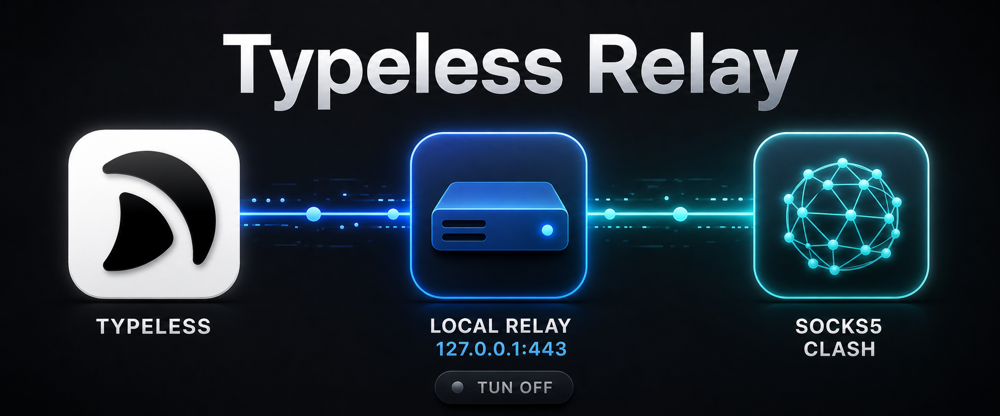

# Typeless Relay

<p align="center">
  
</p>

<p align="center"><sub>非官方社区项目，与 Typeless 官方无隶属或背书关系。</sub></p>

一觉醒来，发现typeless不开tun模式就连不上了，一怒之下就有了这个项目

Typeless Relay 是一个面向 Apple Silicon macOS 的本地 TCP 转发工具。它让 Typeless 桌面应用在 Clash TUN 关闭时，通过 Clash 的 SOCKS5/Mixed 端口访问 `api.typeless.com`。

## 工作原理

Typeless 桌面应用的核心请求会绕过 macOS 系统代理。本项目将 `api.typeless.com` 映射到 `127.0.0.1`，在本机 443 端口接收连接，再通过 Clash 的 SOCKS5 域名请求连接真实服务。

Relay 只搬运原始 TCP 字节，不解密、不替换、也不检查 TLS 内容。

## 使用要求

- Apple Silicon Mac（`arm64`）
- macOS 13 或更高版本
- Clash、Clash Verge Rev 或兼容客户端正在运行
- Clash 已开启 SOCKS5 或 Mixed 端口，默认端口为 `7890`
- Clash 规则应确保 `typeless.com` 走代理，例如：

```yaml
- DOMAIN-SUFFIX,typeless.com,PROXY
```

请将 `PROXY` 换成你配置中实际存在的代理策略组。

## 安装

### 方法一：macOS 安装包

在 [Releases](https://github.com/OkamiFeng/typeless-relay/releases/latest) 下载最新的 `typeless-relay-<版本>-arm64.pkg`，双击并按提示安装。安装包默认使用 Clash 端口 `7890`。

首版安装包未使用 Apple Developer ID 签名。如果 Gatekeeper 阻止打开，请在“系统设置 → 隐私与安全性”中确认打开，或使用下面的终端安装方式。

### 方法二：终端一行命令

使用默认 Clash 端口 `7890`：

```sh
curl -fsSL https://raw.githubusercontent.com/OkamiFeng/typeless-relay/main/install.sh | sh
```

安装时指定 Clash 端口：

```sh
curl -fsSL https://raw.githubusercontent.com/OkamiFeng/typeless-relay/main/install.sh | sh -s -- --socks-port 7891
```

脚本会下载最新 GitHub Release 的 arm64 归档，验证 SHA-256 后请求管理员权限完成安装。

## 自定义 Clash 端口

安装时设置：

```sh
tlr install --socks-port 7891
```

安装后修改：

```sh
tlr config socks-port 7891
```

配置保存在 `/usr/local/etc/typeless-relay.conf`。修改后服务会自动重启。端口必须是 `1` 到 `65535` 的整数。

## 管理命令

```text
tlr install [--socks-port PORT]  安装或恢复系统服务
tlr config socks-port PORT      修改 Clash 端口并重启服务
tlr start                       启动服务
tlr stop                        停止服务
tlr status                      查看服务状态
tlr test                        检查服务、API 和 Clash TUN 状态
tlr log                         持续查看最近 50 行日志
tlr log 100                     查看最近 100 行日志
tlr uninstall                   普通卸载
tlr purge                       完全卸载
```

这些操作会在需要修改系统文件时请求管理员密码。

## 普通卸载与完全卸载

普通卸载：

```sh
tlr uninstall
```

它会停止服务，并删除 Hosts 规则、系统 relay、LaunchDaemon、日志和 Hosts 备份；但会保留 `/usr/local/bin/tlr`、安装载荷和端口配置，因此之后仍可运行 `tlr install` 恢复。

完全卸载：

```sh
tlr purge
```

它会额外删除端口配置、安装载荷、`tlr` 自身及 macOS Installer receipt。执行后项目不会在系统中留下已安装文件。它不会删除你自行克隆的 Git 仓库、下载目录或 `.pkg` 文件。

## 从源码构建

```sh
git clone https://github.com/OkamiFeng/typeless-relay.git
cd typeless-relay
make build
```

生成安装包和网络发布归档：

```sh
make package VERSION=0.1.0
```

产物位于 `dist/`。

## 测试

```sh
make test
make test-package
```

`make test` 不修改系统服务；真实安装、卸载和 purge 测试会修改 `/etc/hosts` 与 launchd，不作为普通单元测试自动运行。

## 故障排查

先运行：

```sh
tlr test
tlr status
tlr log 100
```

常见问题：

- `127.0.0.1:443 unreachable`：服务未运行，或本机 443 端口被其他程序占用。
- `Typeless API unreachable`：Clash 未运行、端口配置错误，或 Typeless 域名没有走代理。
- 修改了 Clash 端口：运行 `tlr config socks-port <新端口>`。
- Clash TUN 显示 enabled：关闭 TUN 后重新运行 `tlr test`。

## 安全说明

- Relay 仅监听 `127.0.0.1`，不会向局域网开放端口。
- Relay 不实施 TLS 中间人代理。
- 安装器只修改本项目标记的 Hosts 区块。
- 网络安装器在执行发布归档前验证 SHA-256。
- 建议先审阅 [`install.sh`](install.sh)，再决定是否使用 `curl | sh`。

## 许可证

[MIT](LICENSE)
